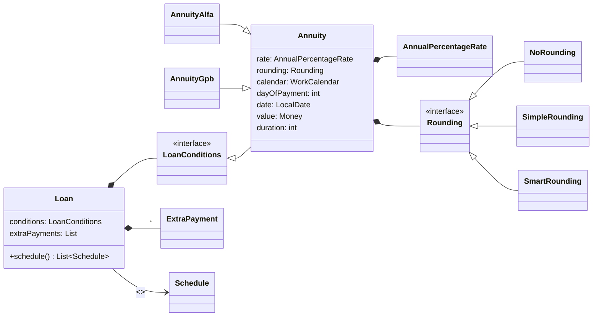

```mermaid
classDiagram
    direction LR
    class Annuity {
        rate: AnnualPercentageRate
        rounding: Rounding
        calendar: WorkCalendar
        dayOfPayment: int
        date: LocalDate
        value: Money
        duration: int
    }
    class AnnualPercentageRate
    class Rounding
    <<interface>> Rounding
    class NoRounding
    class SimpleRounding
    class SmartRounding
    class AnnuityAlfa
    class AnnuityGpb
    
    Annuity *-- AnnualPercentageRate
    Annuity *-- Rounding
    Rounding <|-- NoRounding
    Rounding <|-- SimpleRounding
    Rounding <|-- SmartRounding
    AnnuityAlfa --|> Annuity
    AnnuityGpb --|> Annuity

    class Loan {
        conditions: LoanConditions
        extraPayments: List<ExtraPayment>
        +schedule()  List~Schedule~
    }
    class LoanConditions
    <<interface>> LoanConditions
    
    Loan *-- LoanConditions
    Loan *-- "*" ExtraPayment
    Loan --> Schedule : <<create>>
    LoanConditions <|-- Annuity 
```
